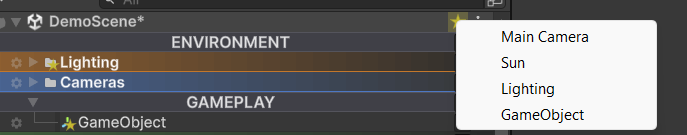

# Bookmarks

Bookmarks let you mark important GameObjects and jump to them from a per-scene menu. Useful for the player, the main camera, the UI canvas, the level director, or anything else you find yourself selecting all the time.

## Bookmarking a GameObject

1. Click the gear icon on the row.
2. Click the star button (`☆` empty / `★` filled) at the bottom of the popup.

A small star badge appears on the row to confirm the bookmark. Click the star again to remove it.

## Jumping to a bookmark

Each scene's header row in the Hierarchy gets a small gold star button on the right side. Click it to open a menu listing every bookmarked GameObject in that scene. Pick one to select and frame it.

Each scene has its own button and its own bookmark list, so multi-scene setups work cleanly.

## Behavior details

- **Inactive GameObjects stay bookmarkable.** A bookmark on a disabled GameObject still appears in the menu so you can find and re-enable it. Most other tools hide inactive objects from search.
- **Bookmark order follows the order you set them.** The menu is not sorted alphabetically; bookmarks appear in the order they were created. This makes a simple ordering scheme work: bookmark in priority order.
- **The badge survives selection.** Selecting a bookmarked GameObject keeps the star visible. Unity's selection highlight redraws the row, but the badge is drawn afterwards so it stays on top.

!!! info
    **Bookmarks are stored on the GameObject**, not in editor preferences. This means a bookmark moves with its scene and survives across machines, branches, and pulls. Every collaborator on the project sees the same bookmarks for that scene.

## Removing all bookmarks

There is no "clear all bookmarks" button. Open the gear popup on each bookmarked object and click the star button again to remove individually, or click **Clear** to wipe all customization on that GameObject.
