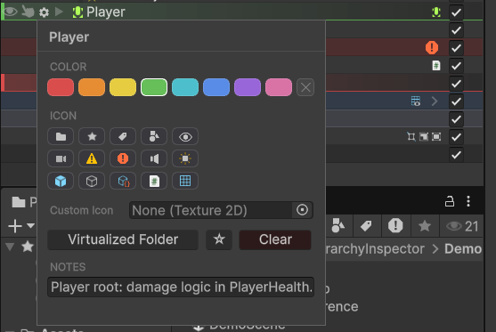

# The Gear Popup

The gear popup is where you customize one GameObject (or a multi-selection) without leaving the Hierarchy window. It opens from a small gear icon that appears on each row.

## Opening it

Hover over a row in the Hierarchy. A gear icon appears next to the GameObject's icon. Click it to open the popup. To customize multiple GameObjects at once, **select them in the hierarchy first** (Ctrl/Cmd-click or Shift-click) and then click the gear on any of the selected rows. The popup will show "N objects selected" at the top and apply edits to all of them.

## What's in the popup

The popup is divided into named sections.

### Color

Eight preset colors. Click a swatch to apply that color to the row; the selected swatch shows a thicker outline. Once a color is set, an **X** button appears at the right of the row, which clears the color.

The eight presets are tuned to read clearly against both dark and light editor skins.

### Icon

Replaces the GameObject's hierarchy icon with a built-in choice. Browse a curated palette of icons that ship with Hierarchy Inspector (folders, gear, eye, bookmark, etc.). Click an icon to apply it. Once an icon is set, an **X** button appears at the right of the icon row, which clears it.

If the curated set isn't enough, the **Custom Icon** field below it accepts any `Texture2D` from your project. Drag a texture in or use the object field. This is great for tagging objects with a logo or category icon you have already authored.

!!! info
    **Icons override the default hierarchy icon, including the "use main component icon" theme behavior.** A row with a custom icon set always shows that icon.

### Virtualized Folder / Bookmark / Clear

Three action buttons:

- **Virtualized Folder.** Marks this GameObject as a virtualization folder. Folders look like folders in the hierarchy and get stripped at build time. See [Virtualization Folders](folders.md) for the full story. The first time you mark a GameObject as a folder, the popup also assigns the default folder icon and a yellow row color (these stay editable; the auto-assignment is a convenience, not a lock-in).
- **Bookmark** (the small star button: `☆` empty / `★` filled). Adds this GameObject to its scene's bookmark list. A small star badge appears on the row. Click again to unbookmark. See [Bookmarks](bookmarks.md).
- **Clear.** Removes all customization (color, icon, notes, folder/bookmark flags) and removes the underlying `HierarchyInspectorData` component from the GameObject.

### Notes

A free-form text field. Anything you type here is stored on the GameObject and is visible whenever you re-open the gear popup on that object. Useful for "this object is referenced from script X" or "remember to bake before shipping" reminders. Notes are NOT shown as tooltips in the hierarchy itself; they live in the popup.

## Multi-select editing

When the popup opens with multiple GameObjects selected, every action applies to all of them. The popup uses the **first** selected object as the source of truth for showing current state (which color/icon is selected). Editing any field writes to all of them.

This is the fastest way to color-tag a whole branch of related GameObjects in one go.

## Where data is stored

Customizations live in a small `HierarchyInspectorData` MonoBehaviour added to the GameObject. The component is hidden in the Inspector by default (it has the `HideInInspector` flag set) so it doesn't clutter the GameObject's component list. It only exists on objects you have actually styled; clicking **Clear** removes it.

!!! warning
    The data component is marked `DontSaveInBuild`, so it is automatically stripped from your built game. Color, icon, and bookmark data is editor-only and adds zero runtime cost.

