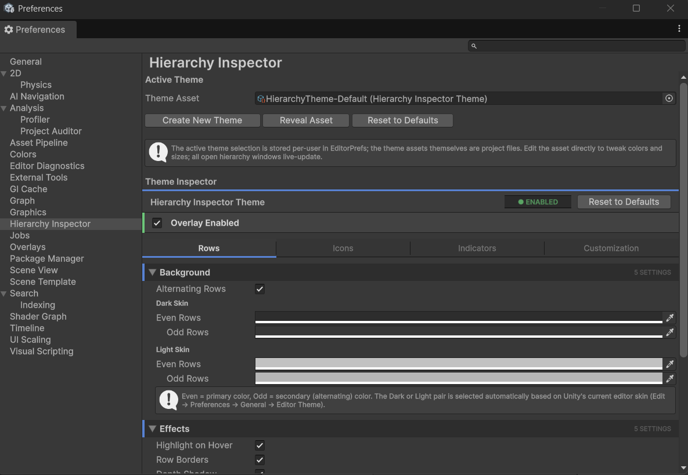

# Themes & Preferences

A **theme** is a `ScriptableObject` asset that holds every setting Hierarchy Inspector uses to draw the hierarchy. You can have multiple themes in your project and switch between them per-user. The default install ships one theme to get you started.

## The Preferences pane

Open **Edit → Preferences → Hierarchy Inspector**. This is the per-user settings pane.

The pane has:

- **Theme Asset.** The currently active theme. Drop in a different `HierarchyInspectorTheme` asset to switch. The selection is stored per-user (in `EditorPrefs`), not in the project, so different team members can have different active themes without stepping on each other.
- **Create New Theme.** Generates a new theme asset in `Assets/Editor/Themes/Hierarchy/` (the folder is created if missing) and switches to it. The new theme starts with the same defaults as the bundled one.
- **Reveal Asset.** Pings the active theme in the Project window so you can find it on disk.
- **Reset to Defaults.** Restores every field on the active theme to its built-in default. Undoable.
- **Embedded inspector.** The active theme's full inspector renders right inside the Preferences pane so you can tweak settings without leaving the dialog.

## Editing a theme

You can edit a theme two ways:

1. **From Preferences** as described above.
2. **Selecting the asset directly.** Find the theme in the Project window, click it, and the Inspector shows the same tabbed editor.

Both routes are equivalent; pick whichever flow fits your hands. Either way, **changes update every open Hierarchy window in real-time**. There is no "Apply" button. The overlay re-reads settings on every paint.

## The theme inspector at a glance

The inspector is organized into **4 tabs**:

| Tab | What it controls |
| --- | --- |
| [Rows](../theme/rows.md) | Backgrounds, hover effects, depth, tree lines, selection |
| [Icons](../theme/icons.md) | Component icons in the gutter, GameObject icons, UI tints |
| [Indicators](../theme/indicators.md) | Prefab tints, missing-script warnings, separator detection |
| [Customization](../theme/customization.md) | Per-object styling, color effects, toolbar, animations |

Each tab is divided into named sections (foldouts). Settings inside a section are usually a parent toggle followed by detail fields. When you turn off a parent toggle, the detail fields gray out and indent so you can see they exist but are not currently in effect. This is **show_if** behavior; the detail fields stay visible for discovery, they just become read-only until you re-enable the parent.

## The master toggle

At the very top of the theme inspector is the **Overlay Enabled** toggle. Turn it off to disable Hierarchy Inspector entirely; you see Unity's stock hierarchy until you re-enable. This is a master switch above every other setting.

A status pill in the header shows the current state at a glance: green "● ENABLED" or red "● DISABLED".

## Bundled themes

Hierarchy Inspector ships with four ready-to-use themes in `Assets/HierarchyInspector/Themes/`:

- **HierarchyTheme-Default.** A balanced setup with all features on at moderate intensity. The active theme out of the box.
- **HierarchyTheme-HighContrast.** Stronger row contrast, brighter selection (yellow), thicker depth shadows, more visible tree lines. For accessibility, sunlit displays, or large hierarchies that need to read at a glance.
- **HierarchyTheme-Minimal.** Most decorations off (no row alternation, no tree lines, no animations, no component icons in the gutter, no prefab tinting). Keeps the essentials: hover, selection, missing-script highlight, override dot. For users who want the per-object styling features without the visual noise.
- **HierarchyTheme-Vibrant.** Saturated palette, magenta selection, warm accent line, icon tinting follows row color. For colorful project styles or fun/casual game projects.

Switch between them in **Edit → Preferences → Hierarchy Inspector** by dragging a different theme asset into the **Theme Asset** field.

## Creating a new theme

If none of the bundled themes fit, make your own. Two ways:

- **From Preferences.** Open **Edit → Preferences → Hierarchy Inspector** and click **Create New Theme**. A new theme asset appears in `Assets/HierarchyInspector/Themes/` and becomes active automatically.
- **From the Project window.** Right-click any folder in your project and choose **Create → Tools → Hierarchy Inspector → Theme**. A new theme asset is created at that location with default values; drag it into the **Theme Asset** field in Preferences to activate it.

Either way, edit the new theme's settings as you want, then switch back to any other theme later by dragging it into the **Theme Asset** field. You can also duplicate any existing theme asset with ++ctrl+d++ to fork its configuration.

!!! info
    **If you installed Hierarchy Inspector via Unity Package Manager** (git URL or OpenUPM), the welcome window automatically copies the four bundled themes into `Assets/HierarchyInspector/Themes/` on first import so you can edit them like any other project file. Only the editor and runtime code stays inside the package; the themes themselves live in your project where you have full control.

!!! info
    **Theme assets travel with the project.** Anyone who pulls the project gets the same themes. The user's *active* selection is the only thing that's per-user.

