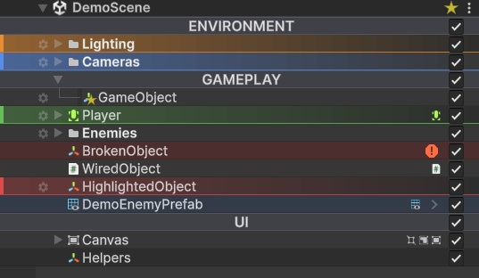

# Getting Started

This page covers installation, the first thing you should see, and how to find every feature.

## Install

1. Download the latest `HierarchyInspector.unitypackage` from the releases page.
2. In Unity, go to **Assets → Import Package → Custom Package…** and pick the file.
3. Click **Import All** when Unity prompts you.

After import, the asset lives at `Assets/Plugins/HierarchyInspector/`. Move it anywhere you like; nothing depends on the path.

## First look

Open any scene. The Hierarchy window will already look different:

- Rows alternate between two slightly different shades.
- Hovering a row brightens it.
- Active and inactive GameObjects render at different opacity.
- Each row has component icons in the right gutter.
- A small gear button appears next to the row label when you hover.

If none of this is happening, check that the active theme is selected: open **Edit → Preferences → Hierarchy Inspector** and pick a theme asset. A default one ships with the package.

!!! info
    **The first time you click the gear** on a GameObject, Hierarchy Inspector adds a small `HierarchyInspectorData` component to it. This component is invisible in the Inspector by default, only present on objects you have actually styled, and **automatically stripped from player builds** (it carries Unity's `DontSaveInBuild` flag). Untouched objects stay clean; built objects ship clean.

## Finding the controls

| What you want | Where to look |
| --- | --- |
| Switch themes, create a new theme, reset to defaults | **Edit → Preferences → Hierarchy Inspector** |
| Edit a theme's colors, sizes, and feature toggles | Select the theme asset; the Inspector is fully tabbed |
| Change one GameObject's color, icon, name, notes | Click the **gear icon** on the row in the Hierarchy |
| Mark a GameObject as a folder | Gear popup, then the **Virtualized Folder** button |
| Bookmark a GameObject | Gear popup, then the star button (`☆` / `★`) |
| Jump to a bookmark | Click the gold star button on the scene's header row in the Hierarchy |
| Copy/paste a row's styling | ++ctrl+shift+c++ to copy the selected row, ++ctrl+shift+v++ to paste |

## Turning the overlay off

If you want to compare against Unity's stock hierarchy or temporarily disable everything, open the active theme asset and uncheck **Overlay Enabled** at the top. The custom rendering shuts off, all callbacks unsubscribe, and you see Unity's default hierarchy. Re-check it to bring everything back. No restart needed.
