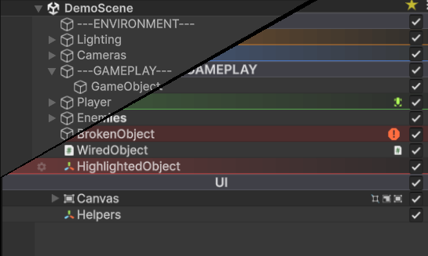

# Hierarchy Inspector

Hierarchy Inspector is a drop-in editor extension that takes Unity's flat Hierarchy window and turns it into something you can actually navigate. It draws on top of every row, lets you tag and color GameObjects, organizes scenes with build-stripped folders, bookmarks frequently-edited objects, and copies styles between rows in a click.

Everything lives in the Editor only. Nothing ships in your build: the per-object data component is marked `DontSaveInBuild` so Unity strips it automatically, and virtualization folder GameObjects are deleted at build time with their children reparented in place. Zero runtime cost, zero lingering references.

## What you get

- **Row visuals.** Alternating stripes, hover highlights, depth shadows, tree connector lines, and dim-on-disable so you can read the hierarchy at a glance.
- **Per-object styling.** A gear popup on every row gives you 8 color presets, a built-in icon picker, custom project icons, notes, folder/bookmark toggles, and multi-select editing.
- **Virtualization folders.** Group GameObjects into pure-editor folders that get stripped at build time. Children are reparented automatically.
- **Bookmarks.** Mark any GameObject for quick navigation, accessed per-scene.
- **Style clipboard.** Copy a row's color, icon, and folder state with ++ctrl+shift+c++, paste with ++ctrl+shift+v++.
- **Indicators.** Prefab tinting, override dots, missing-script highlights, and missing-reference warnings rendered inline.
- **Animations.** Subtle fade-in for new GameObjects, brief flash on rename, and an indent slide on hover.
- **Themes.** Every visual setting is configurable per-theme, switchable per-user.

## Where to start

- **New to the asset?** Read [Getting Started](getting-started.md).
- **Looking for a specific feature?** Browse the **Features** section in the sidebar.
- **Want to tweak the look?** See [Themes & Preferences](features/themes.md) and the **Theme Reference** pages.

## Compatibility

Built against Unity 6 (6000.0+). The extension uses public APIs only and avoids reflection into Unity internals.
