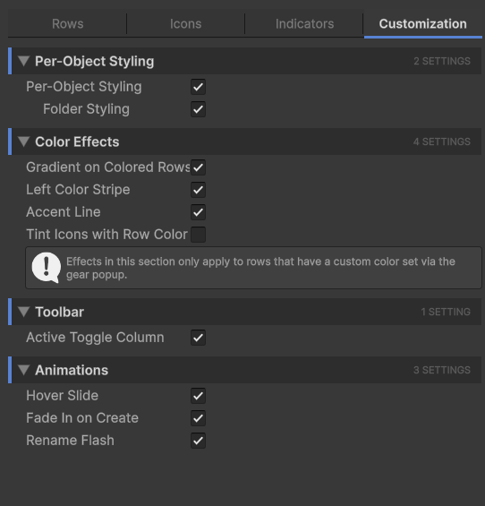

# Customization Tab

The **Customization** tab controls user-driven coloring (the gear popup), color effects on rows that have a custom color, the optional active-toggle column, and animations.

## Per-object styling

This is the master switch for everything driven by the gear popup: color, icon, folder/bookmark flags, notes.

| Setting | Effect |
| --- | --- |
| **Per-Object Styling** | Master toggle. When off, the gear button doesn't show and per-object data isn't read. Hides all customization at once without losing it. |
| **Folder Styling** | When on, virtualization folders get extra visual treatment (folder-style row body, folder icon if no other icon is set). Only takes effect when Per-Object Styling is on. |

## Color effects

These four toggles only affect rows that **already have a custom color set** via the gear popup. They control how that color renders.

| Setting | Effect |
| --- | --- |
| **Gradient on Colored Rows** | Fades the custom color left-to-right back to the row body color. The label area stays cleanly readable while the left edge is fully tinted. |
| **Left Color Stripe** | Draws a thin colored bar on the very left edge of colored rows. Subtle, leaves the row body untouched, useful when you want a hint of the color without flooding the row. |
| **Accent Line** | Draws a thin accent line at the bottom of colored rows. Like a paragraph rule under the row. Combine with Gradient or Stripe for layered emphasis. |
| **Tint Icons with Row Color** | Component icons in the gutter get tinted to match the row's custom color. Loud but striking; off by default. |

!!! info
    **Mix and match.** All four effects can run at once. A common combination is **Left Color Stripe + Tint Icons**: a small color hint plus icon-tinting catches the eye without dominating the row.

## Toolbar

A single setting controlling an extra column of toggles in the hierarchy.

| Setting | Effect |
| --- | --- |
| **Active Toggle Column** | Adds an eye/lock toggle column on the right side of every row, so you can flip a GameObject's `activeSelf` flag with one click without expanding the row's component icons or selecting it first. |

## Animations

Three subtle animations to soften visual transitions.

| Setting | Effect |
| --- | --- |
| **Hover Slide** | When you hover a row, it shifts slightly to the right. Adds physicality to the hover state. |
| **Fade In on Create** | Newly-created GameObjects fade in over a fraction of a second instead of popping into existence. Helps you spot what just appeared in a busy hierarchy. |
| **Rename Flash** | A brief color flash highlights a row when its GameObject is renamed. Catches your eye on the row that changed. |

!!! info
    **Animations are very subtle by default.** They are designed to stay below the threshold of distraction; you should notice them only when you're looking for them. If they bother you, turn them off here.

