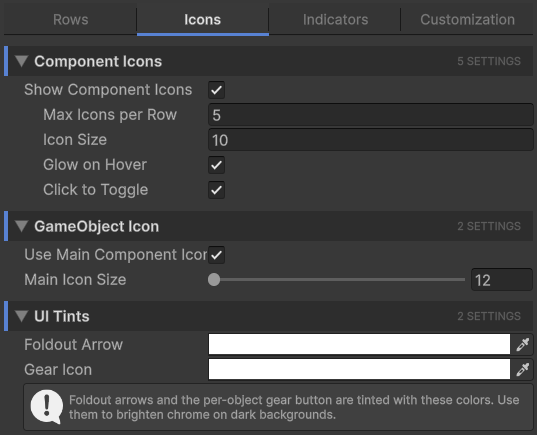

# Icons Tab

The **Icons** tab controls anything icon-shaped: the gutter of component icons on each row, the GameObject's primary icon, and tints applied to UI chrome.

## Component icons

The component icons are the small icons drawn in the right gutter of each row. They show what components are attached to the GameObject (Rigidbody, Camera, Light, custom scripts, etc.) and let you click to toggle them.

| Setting | Effect |
| --- | --- |
| **Show Component Icons** | Master toggle for the gutter. When off, no component icons render and the rest of this section grays out. |
| **Max Icons per Row** | How many icons can stack in the gutter before extras are hidden. The most-recently-added components win. |
| **Icon Size** | Pixel size of each icon. Larger icons are easier to click but take more horizontal space. |
| **Glow on Hover** | When you hover the cursor over an icon, it brightens. A small but useful affordance. |
| **Click to Toggle** | Lets you click an icon to flip that component's `enabled` flag without selecting the GameObject first. Only components that derive from `Behaviour` (i.e. those with an `enabled` flag) are toggleable; structural components like Transform and MeshFilter ignore the click. |

!!! info
    **The Transform component is never shown in the gutter.** Every GameObject has one, so it would just be noise. The first non-Transform component is the one used for the "main component icon" feature on the GameObject icon.

## GameObject icon

The GameObject's primary icon is the one drawn just before its name. By default Unity shows a small cube; this section gives you finer control.

| Setting | Effect |
| --- | --- |
| **Use Main Component Icon** | If the GameObject doesn't have a custom icon set, use the icon of its first non-Transform component instead of the default cube. A row with a Camera will show a camera icon, a row with an AudioSource will show a speaker icon, etc. |
| **Main Icon Size** | Pixel size of the primary icon. Affects layout: the override-dot, label start position, and bookmark badge all shift to accommodate. Range is 12 to 32 pixels. |

## UI tints

Two color fields that tint UI chrome elements drawn on top of rows.

| Setting | Effect |
| --- | --- |
| **Foldout Arrow** | Tint applied to the foldout arrow (the triangle that expands/collapses children). Useful for boosting contrast on dark themes where the default arrow is hard to see. |
| **Gear Icon** | Tint applied to the per-object gear button. Lets you make the gear more or less visible based on your preference. |

!!! info
    **These tints multiply the source texture color**. If you set the gear tint to red, the gear icon's white parts become red. To turn off the tinting, set both colors to pure white (1, 1, 1, 1).

