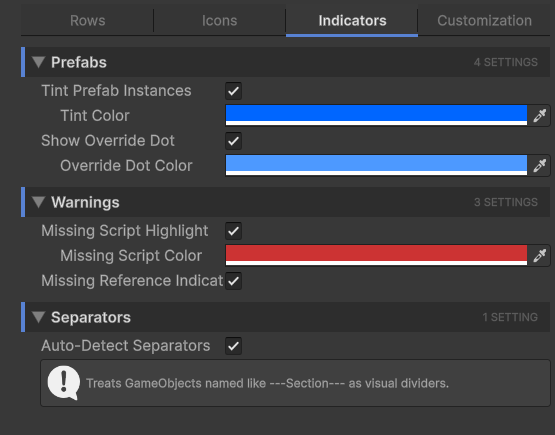

# Indicators Tab

The **Indicators** tab controls the semantic flags drawn on rows: prefab tints, override dots, missing-script highlights, missing-reference indicators, and separator detection.

These are all visual cues to help you spot problem rows or special rows at a glance.

## Prefabs

Two related features for prefab instances.

| Setting | Effect |
| --- | --- |
| **Tint Prefab Instances** | Auto-blend a tint into rows whose GameObject is a prefab instance. Spotting prefab instances vs. plain GameObjects across a deep hierarchy becomes a glance. |
| **Tint Color** | The color blended into prefab instance rows. Default is a soft Unity-blue. Only takes effect when Tint Prefab Instances is on. |
| **Show Override Dot** | Draws a small dot next to prefab instances that have **unsaved overrides** (a property different from the prefab source). Same idea as Unity's blue revert indicator in the Inspector, but visible from the Hierarchy. |
| **Override Dot Color** | The color of the override dot. Only takes effect when Show Override Dot is on. |

## Warnings

Three related features that flag suspicious rows.

| Setting | Effect |
| --- | --- |
| **Missing Script Highlight** | Tints rows whose GameObject has a component slot with a missing script (the dreaded "Missing (Mono Script)" message). Makes the broken row stand out in red instead of looking normal. |
| **Missing Script Color** | The tint color. Default is a saturated red. Only takes effect when Missing Script Highlight is on. |
| **Missing Reference Indicator** | Shows a small indicator on rows whose components have any null serialized reference fields. Helpful for catching unwired references before play. |

!!! warning
    **Missing Reference Indicator only checks reference fields**, not all fields. It looks at `Object` references, `[SerializeReference]` fields, and the like. Plain string/int/float fields are not validated.

## Separators

A small organizational feature for keeping a long hierarchy readable.

| Setting | Effect |
| --- | --- |
| **Auto-Detect Separators** | Treats GameObjects whose name matches the pattern `---Section---` (or similar dash-wrapped patterns) as visual dividers. The row is rendered as a thick horizontal divider with the inner text as a section label. |

This is a community convention many Unity developers already use; Hierarchy Inspector just makes it look intentional instead of like a regular GameObject with an unusual name.

