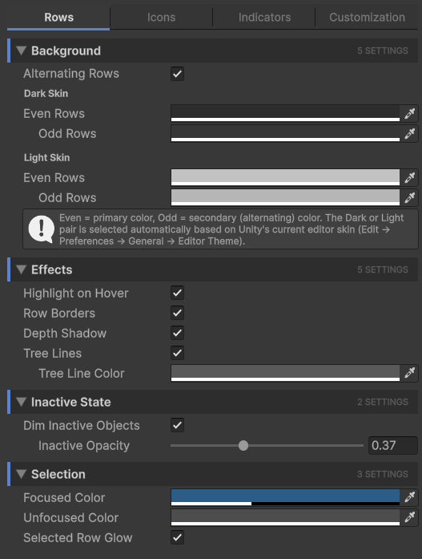

# Rows Tab

The **Rows** tab controls everything that draws on every row in the hierarchy: backgrounds, scan-improvement effects, the inactive-state look, and selection.

## Background

| Setting | Effect |
| --- | --- |
| **Alternating Rows** | Tints odd rows with the secondary color so consecutive rows are easier to scan. When off, every row uses the primary color. |
| **Even Rows** (Dark/Light) | The primary row body color. Used on every row when alternating is off, or on even-numbered rows when it's on. |
| **Odd Rows** (Dark/Light) | The secondary row body color. Only takes effect when Alternating Rows is on. |

Two sets of colors are stored, one for Unity's dark editor skin and one for the light skin. The active set is picked automatically based on **Edit → Preferences → General → Editor Theme**.

## Effects

| Setting | Effect |
| --- | --- |
| **Highlight on Hover** | The row under your mouse cursor gets brightened. Helpful for tracking which row a click would land on. |
| **Row Borders** | A subtle 1px line is drawn between rows. Useful at higher row densities. |
| **Depth Shadow** | A soft shadow is drawn at the left edge of each nesting level so depth reads at a glance, even on flat color rows. |
| **Tree Lines** | Connector lines drawn between parent and child rows, like a file tree. |
| **Tree Line Color** | The color of the tree connector lines. Only takes effect when Tree Lines is on. |

## Inactive state

GameObjects that are disabled in the hierarchy can be visually de-emphasized.

| Setting | Effect |
| --- | --- |
| **Dim Inactive Objects** | When on, inactive GameObjects render at reduced opacity. Their text, icons, and row body all fade. |
| **Inactive Opacity** | The dim factor. `0` means fully invisible, `1` means no dim at all. The slider is a multiplier applied to row contents. Only takes effect when Dim Inactive Objects is on. |

The default value (around 0.4) is a good balance: inactive rows are clearly de-emphasized but still readable.

## Selection

How selected rows look. Unity's hierarchy distinguishes between **focused** and **unfocused** selection (the keyboard focus is in the Hierarchy vs. somewhere else like the Scene view).

| Setting | Effect |
| --- | --- |
| **Focused Color** | Row body color when the Hierarchy window has keyboard focus. The visually loud "this is selected" color. |
| **Unfocused Color** | Row body color when the Hierarchy doesn't have focus. Usually a quieter gray so it doesn't compete with the Scene view. |
| **Selected Row Glow** | Adds a soft glow at the bottom edge of the selected row. Subtle, but makes the selected row pop without changing the body color. |

