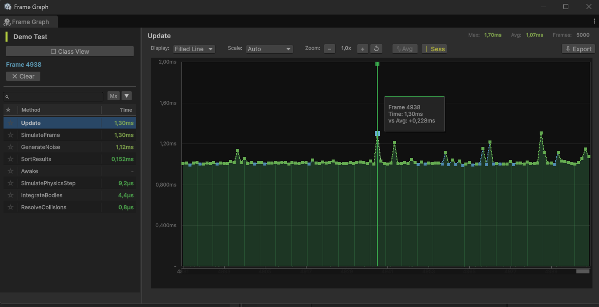

# The Frame Graph

The frame graph is a dedicated window for inspecting a method's per-frame history in detail. Where the profiler window shows one live number per method, the frame graph shows the whole recorded timeline and lets you stop on any single frame.

## Opening it

Click a row's **History** sparkline in the [Profiler Window](profiler-window.md). This freezes a snapshot of the profiler's data and opens the frame graph on that method.

!!! info "Opening pauses Play Mode"
    Opening the frame graph pauses the editor and captures a frozen snapshot. The graph keeps showing that snapshot even after you resume the game, so the data you are inspecting will not shift under you.

## Layout

- **Left panel** lists every method in the profiler, with its own search, sort (name, max time, average time, call count), and pinning. Click a method to graph it.
- **Graph panel** plots the selected method's time per frame, with a value (Y) axis and a frame (X) axis.

## Graph modes

In single-method view, a **Display** dropdown switches between:

- **Bars** draws one bar per frame.
- **Line** draws a line through the per-frame values.
- **Filled Line** draws the line with the area beneath it filled.

Supporting controls:

- **Scale** sets the time unit (Auto, Milliseconds, or Microseconds).
- **Zoom** changes how many frames fit on screen; a reset button returns to the default view.
- **Avg** overlays a moving-average line to see the trend through noisy data.
- **Sess** shows session markers where measurement sessions began.

## Class view

The **Class View** toggle in the left panel switches to a stacked view of every method in the profiler at once, drawn as a stacked area chart with a color legend beneath the graph. This shows how the frame's total time is divided between methods over time. Right-click a method in the legend to hide it from the stack, and use **Show All** to bring hidden methods back.

## Reading spikes

- **Hover** a frame to see its exact value.
- **Click a bar or frame** to select it; the left panel's time column then shows each method's time for that one frame, so you can see what ran during a spike.
- **Drag across frames** to select a range; the time column then averages each method over that range.
- Use **Clear** in the left panel to drop the selection and return to viewing max values.

A tall isolated bar is a one-frame spike; a sustained plateau is steady per-frame cost. Switch to class view on a spike frame to see which method caused it.
