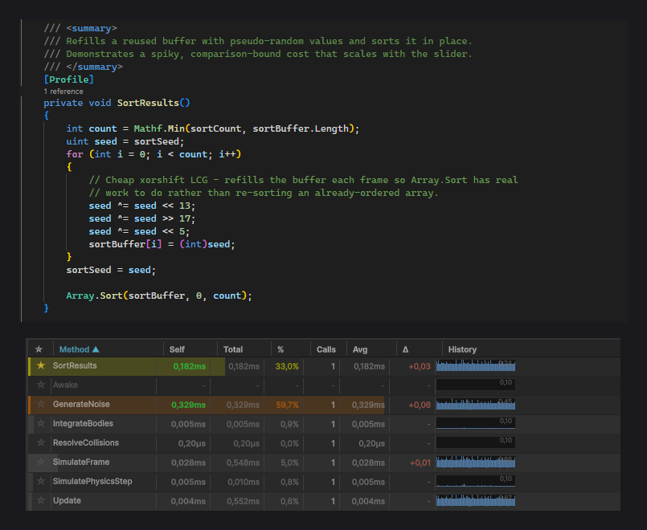

# The Profile Attribute

`[Profile]` is the primary way you drive Profiler Decorator. You place it in your code, and an IL post-processor weaves timing instrumentation into the compiled assembly. There are no manual timer calls to write and nothing to strip before a build.



## Method level

Add `[Profile]` to a single method to measure just that method:

```csharp
using SpaceWhale.ProfilerDecorator;

public class MeshBaker : MonoBehaviour
{
    [Profile]
    public void BakeChunk()
    {
        // Only this method is timed.
    }
}
```

Each time the method runs, its self time (exclusive) and total time (inclusive of any nested `[Profile]` calls) are recorded for the current frame.

## Class level

Add `[Profile]` to a class to profile every method in it. This is the fastest way to find the hot method inside a subsystem without annotating each one:

```csharp
using SpaceWhale.ProfilerDecorator;

[Profile]
public class GraphGenerator
{
    public void Generate() { /* timed */ }
    private void Subdivide() { /* timed */ }
    private void Relax() { /* timed */ }
}
```

Nested calls between the class's own methods build a self vs total breakdown, so you can see which method owns the time even when they call each other.

### Name and Color

Class-level `[Profile]` accepts a display name and a color for the profiler's box in the window and its console log header. `Color` takes a hex string, with or without the leading `#`:

```csharp
[Profile(Name = "Dungeon Generation", Color = "#FF6600")]
public class GraphGenerator { /* ... */ }
```

`Name` and `Color` are read at the class level. Without `Name`, the class name is used; without `Color`, the profiler defaults to light blue.

### AutoLog

Class-level `[Profile]` also exposes `AutoLog` (default `true`). When enabled, the profiler writes a formatted summary to the Unity console when its session ends. Set it to `false` to keep the console quiet and read results only in the window:

```csharp
[Profile(Name = "Physics Pass", AutoLog = false)]
public class PhysicsPass { /* ... */ }
```

## Excluding a method with [NoProfile]

When a class carries `[Profile]`, every method is instrumented, including trivial ones like getters. Mark the methods you do not care about with `[NoProfile]` to keep the table focused:

```csharp
[Profile]
public class GraphGenerator
{
    public void Generate() { /* timed */ }

    [NoProfile]
    public int NodeCount => _nodes.Count; // skipped
}
```

## What gets instrumented

`[Profile]` and `[NoProfile]` apply to methods and constructors. `[Profile]` additionally applies to classes (which cascades to their methods).

!!! info "Zero cost in builds"
    Do not wrap `[Profile]` in `#if UNITY_EDITOR`. The IL post-processor needs to find the attribute in the compiled assembly. The attribute itself is inert metadata with no runtime behavior, and the timing bodies it drives are Editor-only, so a player build measures nothing and pays nothing.
