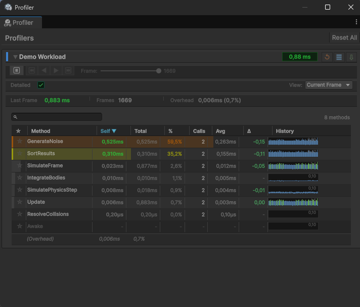

# The Profiler Window

The profiler window is where instrumented methods show up live while you play. Open it from **Tools → Profiler Decorator → Profiler Window**.

Each `[Profile]` class (or standalone `[Profile]` method group) gets its own collapsible box, tagged with the profiler's color and a headline time pill for the frame. Inside the box is a sorted table of methods, worst offenders first.

!!! info "Play Mode only"
    Profilers are created when the game runs and the first `[Profile]` method executes. Before then, the window shows an "Enter Play Mode" message.

## The method table

The table is sorted with the slowest method (highest self time) at the top by default, so the frame's worst offender is always the first row. Columns:

| Column | Meaning |
| --- | --- |
| **Star** | Pin a method to keep it at the top of the list regardless of sort. |
| **Method** | The method (or custom `[Profile]` name). |
| **Self** | Self time: exclusive, excluding time spent in nested `[Profile]` calls. |
| **Total** | Total time: inclusive, including nested `[Profile]` calls. |
| **%** | Share of the frame, based on self time. |
| **Calls** | Number of times the method ran this frame. |
| **Avg** | Average self time per call. |
| **Δ** | Change from the previous frame (green is faster, red is slower). |
| **History** | A per-frame sparkline of this method's time. |

### Self vs total time

**Self** time is what the method spent in its own body. **Total** time also counts any nested `[Profile]` methods it called. When a method has a high total but a low self, the cost is in its children; drill down to find the real hot spot. When self and total are close, the method itself is the cost.

## Sorting and search

- **Click a column header** to sort by that column. Click again to flip the direction.
- **Search field** above the table filters methods by name; the count readout shows how many match.
- The default sort is **Self**, descending, so the worst offender leads.

## View mode

A **View** dropdown switches the numbers between:

- **Current Frame** shows the last completed frame's values (the live, per-frame view).
- **Max Values** shows the peak each method has reached across the session, useful for catching intermittent spikes.

The **Detailed** toggle controls whether per-method category data is recorded. With it off, the profiler tracks only overall frame time for less overhead.

## Overhead readout

The statistics bar reports **Overhead**: the estimated cost of the instrumentation itself for the frame, in both time and percentage of the frame. Keep an eye on it; if overhead is a large share of the measured time, the numbers for very cheap methods are less trustworthy. This is why excluding trivial methods with `[NoProfile]` helps.

## Per-frame history

Every row's **History** column draws a live sparkline of that method's recent frames. Click a row's sparkline to open the [Frame Graph](frame-graph.md) window, which freezes the data and lets you inspect individual frames.

## Per-profiler actions

Each profiler box has icon buttons in its header:

- **Reset** clears that profiler's accumulated data.
- **Log** writes a formatted breakdown to the Unity console.
- **Export** saves the profiler's data to a CSV file.

A **Reset All** button at the top of the window clears every registered profiler at once.

## Pausing to inspect (time travel)

The controls row includes a pause button that freezes Play Mode and lets you step frame by frame through the recorded history with the frame navigation buttons and slider. This is handy for stopping on a spike and reading exactly what ran that frame. Resume to return to live capture.
