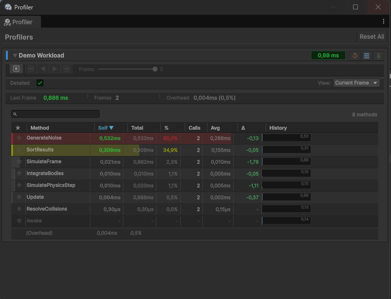

# Getting Started

This page covers installation, the first thing you should see, and how to find every feature.

## Install

Profiler Decorator installs through the Unity Package Manager as a git URL.

1. In Unity, open **Window → Package Manager**.
2. Click the **+** button in the top-left and choose **Add package from git URL...**
3. Paste the URL below and click **Add**:

```
https://github.com/OverGast/Profiler-Decorator.git?path=Assets/ProfilerDecorator
```

To pin a specific release instead of tracking the default branch, append a tag to the URL:

```
https://github.com/OverGast/Profiler-Decorator.git?path=Assets/ProfilerDecorator#v1.0.0
```

The package id is `com.spacewhale.profilerdecorator`.

!!! info "Asset Store"
    An Asset Store listing is coming soon. Until then, the git URL above is the supported install route.

## First look

1. Open any script and add `[Profile]` to a method that does real work:

    ```csharp
    using SpaceWhale.ProfilerDecorator;

    public class TerrainBuilder : MonoBehaviour
    {
        [Profile]
        private void Rebuild()
        {
            // ... the work you want to measure ...
        }
    }
    ```

2. Enter Play Mode and make sure the method actually runs.
3. Open **Tools → Profiler Decorator → Profiler Window**.
4. Watch a profiler box appear and its method table populate frame by frame.



!!! info "Editor-only measurement"
    All timing happens in the Editor. The instrumentation bodies are wrapped in `#if UNITY_EDITOR`, so a player build carries no profiling cost. The `[Profile]` attribute stays in the compiled assembly as plain metadata (the IL post-processor needs to find it), but it does nothing at runtime in a build.

## Finding the controls

| What you want | Where to look |
| --- | --- |
| Profile a single method | Add `[Profile]` to the method |
| Profile every method in a class | Add `[Profile]` to the class |
| Exclude one method from a `[Profile]` class | Add `[NoProfile]` to that method |
| See self vs total time | The **Self** and **Total** columns in the method table |
| See per-frame history | The **History** sparkline column on each row |
| Open the frame graph | Click a row's **History** sparkline (this pauses Play Mode) |
| Open the profiler window | **Tools → Profiler Decorator → Profiler Window** |
| Open the welcome / help window | **Tools → Profiler Decorator → Welcome** |

## Troubleshooting

If nothing appears in the window:

- **Are you in Play Mode?** Profilers are created and populated only while the game runs.
- **Is the method actually executing?** A `[Profile]` method that never gets called produces no data. Confirm the code path runs in Play Mode.
- **Is `[Profile]` on the method or its class?** Only annotated methods (or all methods of an annotated class) are measured. A method with `[NoProfile]`, or one in an un-annotated class, is skipped.
